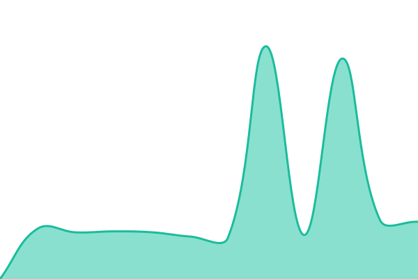
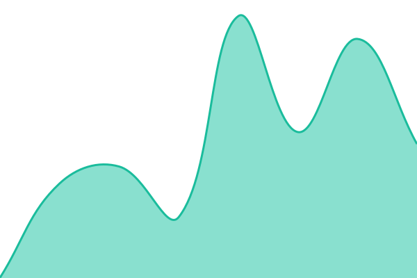
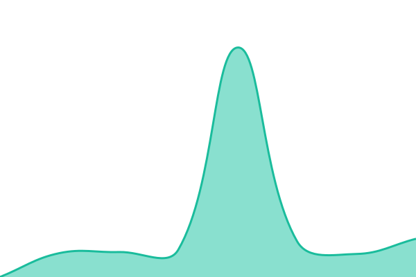

# [📈 Live Status](https://demo.upptime.js.org): <!--live status--> **🟧 Partial outage**

This repository contains the open-source uptime monitor and status page for [InfiScale Technologies Pvt. Ltd.](https://infiscale.io), powered by [Upptime](https://github.com/upptime/upptime).

With [Upptime](https://upptime.js.org), you can get your own unlimited and free uptime monitor and status page, powered entirely by a GitHub repository. We use [Issues](https://github.com/infiSCALE/upptime/issues) as incident reports, [Actions](https://github.com/infiSCALE/upptime/actions) as uptime monitors, and [Pages](https://demo.upptime.js.org) for the status page.

<!--start: status pages-->
<!-- This summary is generated by Upptime (https://github.com/upptime/upptime) -->
<!-- Do not edit this manually, your changes will be overwritten -->
<!-- prettier-ignore -->
| URL | Status | History | Response Time | Uptime |
| --- | ------ | ------- | ------------- | ------ |
|  [infiSCALE™ Home](https://www.infiscale.io) | 🟩 Up | [infi-scale-home.yml](https://github.com/infiSCALE/upptime/commits/HEAD/history/infi-scale-home.yml) | 

 3955ms
     
 | 

<a href="https://infiscale.github.io/upptime/history/infi-scale-home">100.00%</a>
    

|  [infiSCALE™ Magento Shop](https://shop.infiscale.io) | 🟩 Up | [infi-scale-magento-shop.yml](https://github.com/infiSCALE/upptime/commits/HEAD/history/infi-scale-magento-shop.yml) | 

 433ms
     
 | 

<a href="https://infiscale.github.io/upptime/history/infi-scale-magento-shop">100.00%</a>
    

|  [infiSCALE™ CMS](https://www.infiscale.io/wp-admin/) | 🟩 Up | [infi-scale-cms.yml](https://github.com/infiSCALE/upptime/commits/HEAD/history/infi-scale-cms.yml) | 

 3237ms
     
 | 

<a href="https://infiscale.github.io/upptime/history/infi-scale-cms">96.77%</a>
    

|  [infiSCALE™ GraphQL Endpoint](https://www.infiscale.io/graphql/) | 🟥 Down | [infi-scale-graph-ql-endpoint.yml](https://github.com/infiSCALE/upptime/commits/HEAD/history/infi-scale-graph-ql-endpoint.yml) | 

 2140ms
     
 | 

<a href="https://infiscale.github.io/upptime/history/infi-scale-graph-ql-endpoint">0.44%</a>
    

<!--end: status pages-->

[**Visit our status website →**](https://demo.upptime.js.org)

## 📄 License

- Powered by: [Upptime](https://github.com/upptime/upptime)
- Code: [MIT](./LICENSE) © [InfiScale Technologies Pvt. Ltd.](https://infiscale.io)
- Data in the `./history` directory: [Open Database License](https://opendatacommons.org/licenses/odbl/1-0/)
